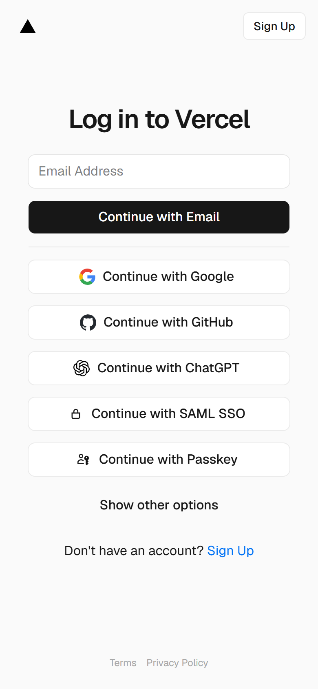
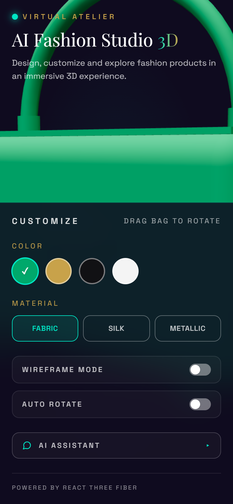

# Open It on Your Phone — Week 7

## Assignment Overview

For this assignment, I reviewed my portfolio with a **mobile-first approach**. The main goal was to make sure the portfolio works properly on a real phone and remains responsive on tablet and desktop screens.

I checked the layout, typography, buttons, project images, links, accessibility, contrast, and overall performance.

## What I Checked

- Mobile layout on a real phone
- Tablet responsiveness
- Desktop responsiveness
- Text size and line spacing
- Button and link usability
- Project images and image quality
- Color contrast
- Navigation and section spacing
- Demo links
- GitHub/repository links
- Oversized images
- Broken layouts and overflow issues

## Problems Found & Fixes

| Before | Problem | After / Fix |
| ------ | ------- | ----------- |
| Mobile layout | Some sections had spacing/layout issues | Adjusted responsive spacing and sizing |
| Text | Some text was difficult to read on smaller screens | Improved font sizes and line-height |
| Buttons | Some buttons were too small or difficult to tap | Increased button size and spacing |
| Project images | Images could lose quality or take too much space | Optimized image sizing and responsive behavior |
| Links | Portfolio links needed verification | Checked demo and repository links |
| Desktop-only layout | Some elements were not ideal on smaller widths | Added responsive adjustments |
| Accessibility | Contrast and readability needed review | Improved contrast and readability |
| Performance | Large assets could affect loading | Compressed/optimized oversized images |

## Verified on the Live Deployment

Testing was done against the deployed site (**Lighthouse 12.8.2, Mobile form factor, 16 Aug 2026**):

| Metric | Before | After |
| ------ | -----: | ----: |
| Performance | 59 | 67 |
| Accessibility | 100 | 100 |
| Best Practices | 100 | 100 |
| SEO | 100 | 100 |
| LCP | 2.5 s | 1.9 s |
| FCP | 2.0 s | 1.2 s |
| TBT | 7,110 ms | 2,910 ms |
| CLS | 0.003 | 0 |

**Responsive checks (automated, headless Chrome):** no horizontal overflow and no console errors at 320 px, 390 px, 412 px, 768 px, and 1280 px.

**Tap targets:** all interactive controls now meet the 44 px minimum recommended size (material buttons and the AI Assistant launcher were 42 px; raised with `min-h-11`).

**Readability:** no text below 12 px (the "Virtual Atelier" brand stamp at 11 px and the "Drag bag to rotate" hint at 10 px were raised to 12 px).

**Accessibility:** 100 — dialog semantics, focus trap, roving tabindex, contrast, and live region announcements were verified in the [AUDIT.md](./AUDIT.md) report (28/28 automated keyboard checks).

## AI Audit

I also used AI to review the portfolio from a mobile, accessibility, and performance perspective.

### Audit Prompt

> "What is broken on mobile in this portfolio? Identify accessibility problems, readability issues, responsive layout problems, broken interactions, image optimization issues, and anything that could make the website slow. For every issue, explain why it matters and suggest a practical fix."

The AI audit helped me identify problems that are easy to miss when testing only on a desktop browser.

## Before & After

### Before

### After

## Final Testing

After making the fixes, I tested the portfolio across:

- 📱 Mobile
- 📱 Tablet
- 💻 Desktop

I also manually checked the important navigation, project demo links, repository links, buttons, and responsive sections.

## Final Result

The portfolio is now more reliable on mobile, easier to read, easier to interact with, and cleaner across different screen sizes.

### Live Portfolio

https://ai-fashion-studio-3d.vercel.app

## Q&A / Feedback Prompt

For feedback, I would like reviewers to focus on these questions:

1. Does the portfolio feel professional and trustworthy on a real mobile device?
2. Is the text comfortable to read without zooming?
3. Are the buttons and links easy to tap?
4. Do the project images look sharp and load efficiently?
5. Is there any section that still looks broken or awkward on mobile, tablet, or desktop?
6. Are there any accessibility or contrast problems I may have missed?
7. Is the portfolio fast enough and does anything appear unnecessarily heavy?
8. What is the **one most important improvement** I should make next?

## Reflection

This assignment showed me that a portfolio can look good on desktop but still have usability problems on a real phone. Testing the actual mobile experience helped me notice issues that are easy to miss when simply resizing a browser window.

The main lesson I learned is that small details such as readable text, tappable buttons, optimized images, working links, spacing, and accessibility have a big impact on whether a portfolio feels professional and trustworthy.

## Detailed Audit

Full accessibility and performance audit: [AUDIT.md](./AUDIT.md)
